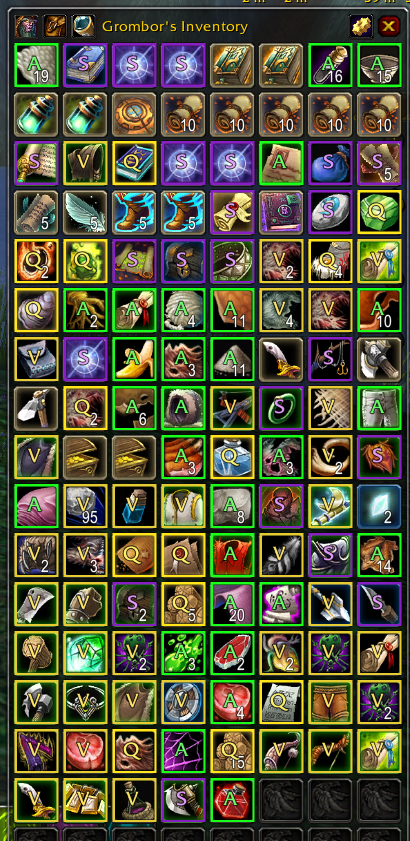
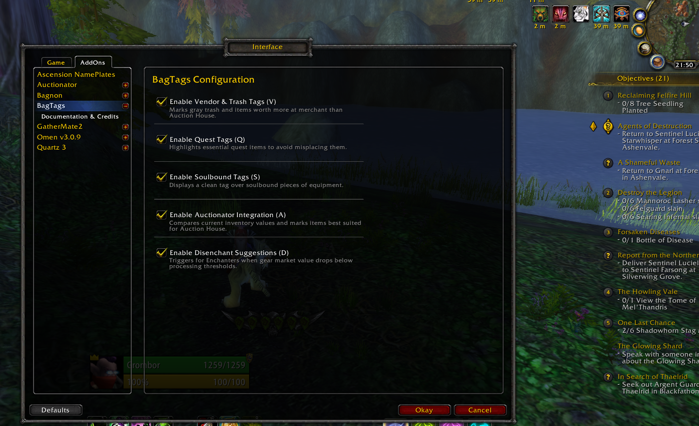
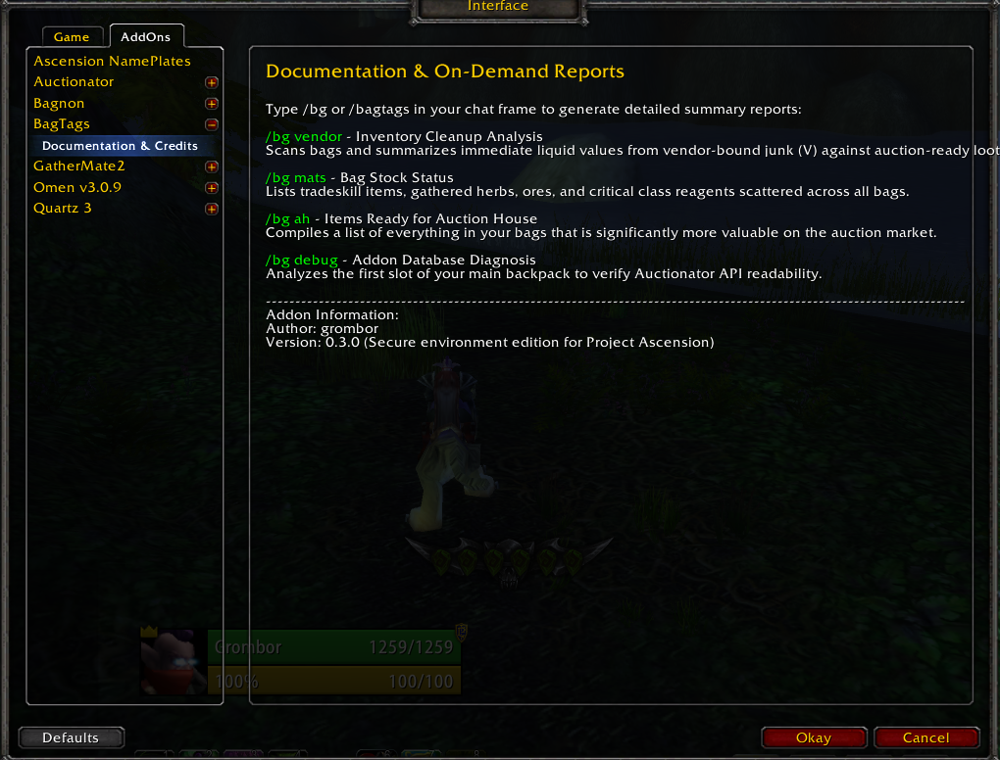

# BagTags (v0.7.3)

**BagTags** is a lightweight, high-performance inventory management addon for World of Warcraft 3.3.5a (optimized for custom realms like *Project Ascension*). It eliminates the guesswork from inventory management by overlaying dynamic smart tags on your items based on real-time market data, ensuring you always make the most profitable decision when clearing your bags.

Additionally, BagTags features a custom, safe asynchronous sorting engine that completely fixes the native broken bag sorting functionality in Bagnon.

---

## 🚀 Key Features

*   **Dynamic Smart Tagging:** Overlays actionable indicators directly onto item icons in your bags:
    *   **[V] Vendor:** Gray items or gear whose direct merchant sell value safely outclasses active Auction House listings.
    *   **[A] Auction House:** High-value marketplace items that clear deposit risks and fee thresholds based on active data.
    *   **[D] Disenchant:** Contextual suggestions for characters with the Enchanting profession when projected materials yield a reliable profit.
    *   **[Q] Quest:** Highlights active quest inventory items with a distinct border to prevent accidental deletion.
    *   **[S] Soulbound:** Displays a subtle label over soulbound equipment items for easy gear progression tracking.
*   **Bagnon Sorting Fix:** Features a native 3.3.5a asynchronous bag sorter that safely orders your backpack by rarity, type, and name without triggering interface locks.
*   **Deep Auctionator Integration:** Seamlessly cross-references real-time 24-hour database prices, cutting out deposit risks automatically.

---

## ⚙️ In-Game Configuration

BagTags features a full graphical interface in the native WoW Options menu to easily toggle specific tags on or off to suit your playstyle. It also includes a draggable minimap shortcut supporting Left-Click (Open Options) and Right-Click (Trigger Bag Sort).

---

## 🛠️ Chat Commands & Reports

Type `/bg` or `/bagtags` followed by a sub-command to run real-time inventory audits directly in your chat frame. You can also view available features inside the dedicated in-game sub-panel.

| Command | Action |
| :--- | :--- |
| `/bg` | Displays the help menu with all available usage options. |
| `/bg vendor` | Performs an analysis on all merchantable junk and safe-to-vendor gear, displaying total value. |
| `/bg mats` | Generates an immediate breakdown of your crafting stock and raw materials audit. |
| `/bg ah` | Lists all high-valuation targets currently viable for active Auction House trades. |
| `/bg sort` | Triggers the native asynchronous container sorting routine manually. |
| `/bg debug` | Troubleshoots internal database cross-reference bindings on your main bag's first slot. |

---

## 📦 Installation

1. Download the latest release of **BagTags**.
2. Extract the folder into your WoW directory: `Interface\AddOns\`.
3. Ensure the folder name is exactly `BagTags`.
4. Log into the game, make sure "Load out of date AddOns" is checked, and enjoy!

---

## ⚙️ Requirements & Compatibility

*   **Game Version:** WoW Client 3.3.5a
*   **Supported AddOns:** Fully compatible with the standard Blizzard UI and **Bagnon**.
*   **Recommended AddOns:** **Auctionator** (required for active market pricing, `[A]` and `[D]` tags).

---

## 📄 License

This project is licensed under the MIT License - see the [LICENSE](LICENSE) file for details.

---

## 📝 Credits & Authors

*   **Author:** grombor
*   **Version:** 0.7.3
*   *Feedback and bug reports are welcome via GitHub Issues or Discord!*